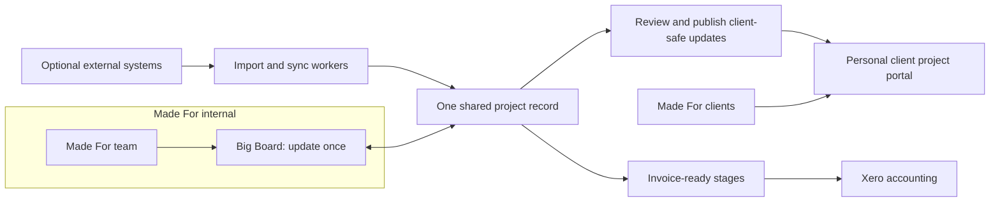

# Made For Platform — Technical Architecture

## Architectural recommendation

Build one modular web platform with two experiences:

- **Internal Big Board** for Made For staff.
- **Client Project Portals** scoped to individual projects.

Both use one canonical project record, identity system, document store, audit model, and integration layer. Do not build or synchronize separate internal and client databases.

Use a modular monolith plus background workers rather than microservices. At approximately 20 new client trackers per year, operational simplicity and permission safety matter more than distributed-system scale.

## Recommended implementation baseline

- Next.js/React with TypeScript, preserving the prototypes’ visual language.
- Managed PostgreSQL, authentication, row-level security, and private object storage in an Australian region; Supabase is a suitable default pending procurement review.
- One Vercel Pro multi-tenant project with staging and production environments.
- Transactional email for invitations, reminders, published updates, approvals, and invoice-ready notifications.
- Background jobs and a transactional outbox for imports, document scanning, notifications, Xero synchronization, retries, and reconciliation.
- Organisation boundaries on core records from day one, without building commercial multi-tenancy or SaaS billing in v1.

## Core domain modules

### Identity and access

- Organisations, offices, users, memberships, project memberships, roles, invitations, sessions, and MFA.
- Staff roles: director, state lead, project lead, team member, accounts, and administrator.
- Client roles: viewer and approver, scoped to named projects.
- Field-level restrictions for opportunity values, Made For fees, margins, rates, internal notes, capacity, and tender-sensitive material.

### Commercial pipeline

- Opportunities, source, client/prospect, owner, heat/confidence, estimated value, expected close, notes, and win/loss history.
- A won opportunity creates a separate linked project while retaining immutable opportunity history.

### Canonical project

- Stable project ID and code, office, client organisation, team, lifecycle template/version, status, dates, stages, milestones, fee schedule, portal state, and source opportunity.
- All project modules reference this ID instead of maintaining competing project records.
- Internal delivery stages and the client programme remain distinct concepts that can be linked.

### Weekly planning, work, and capacity

- Monday issues, six-question responses, confirmations, exceptions, priorities, carry-over, and immutable snapshots.
- Tasks with assignee, project, due date/week, priority, order, completion history, and estimated minutes.
- Estimates validated in 15-minute increments up to the configured working day.
- Availability, leave/non-project time, project allocations, task demand, and capacity warnings remain distinct to avoid double-counting.

### Client delivery

- Published progress reports, programme baselines/current forecasts, milestones, budget and variation workflow, document register/versioning, team responsibilities, and tender.
- Approvals always target a specific immutable version.

### Governance

- Append-only audit entries for actor, organisation, project, action, entity, before/after summary, timestamp, and correlation ID.
- Domain events such as `PitchWon`, `ProjectCreated`, `WeeklyIssuePublished`, `VariationApproved`, `DocumentVersionIssued`, and `InvoiceMarkedReady`.
- Operational state and outbox events written in the same transaction; consumers are idempotent.

## Client publication without double handling

The tracker is not a second product Made For must update manually.

1. Staff updates or connected-system imports write once to canonical project records.
2. Approved structured facts can update client views automatically: issued documents, published programme dates, approved variations, and approved team information.
3. Narrative or sensitive changes stay internal as drafts.
4. The system pre-fills a client update from Monday responses, completed work, milestone changes, and outstanding items.
5. A project lead previews the exact client view and publishes it.
6. Publishing creates an immutable client-safe revision, records the source versions and publisher, invalidates the portal cache, and optionally sends a notification.

Client responses must come from explicit client-safe queries/read models. The application must not load unrestricted internal objects and merely hide fields in the browser.

## Personal client URLs

Use one Vercel deployment and one database for every portal:

- Production: `project-slug.projects.made-for.com.au`
- Staging: `project-slug.staging.projects.made-for.com.au`
- Optional client domain: `progress.client.com`

Next.js hostname routing resolves the request to a `portal_host` and `project_id`. The hostname selects the project experience but never grants access by itself; authentication and project membership remain mandatory for sensitive data and files.

Wildcard DNS and TLS can be delegated to Vercel while the existing `made-for.com.au` website and apex DNS remain with their current provider. Optional client-owned domains can be added and verified through Vercel’s Projects Domain API.

Each project stores stable slugs, aliases/redirects, Made For co-branding, client identity, contacts, and approved theme settings. Do not create separate deployments for each project.

Relevant Vercel documentation:

- [Multi-tenant platform concepts](https://vercel.com/docs/platforms/multi-tenant-platforms/concepts)
- [Middleware and hostname routing](https://vercel.com/docs/platforms/multi-tenant-platforms/middleware-and-routing)
- [Wildcard domain with split DNS](https://vercel.com/kb/guide/wildcard-domain-without-vercel-nameservers)
- [Add a domain through the Projects API](https://vercel.com/docs/rest-api/projects/add-a-domain-to-a-project)

## Files and versioning

- Upload directly to private object storage through controlled, short-lived upload sessions.
- Validate file type/size, calculate checksums, scan for malware, and quarantine failures.
- A replacement upload creates a new immutable version; it never overwrites the issued object.
- Statuses and approvals point to a specific version.
- Downloads use short-lived, authorization-checked signed URLs.
- Define quotas, previews, retention, archival, and deletion obligations before moving historical Dropbox content.

## Security and operational requirements

- Deny-by-default authorization enforced in the application and database.
- Staff MFA; expiring client invitations, managed sign-in, session revocation, and access history.
- Optimistic concurrency/version numbers for budgets, programmes, documents, approvals, and Monday editing.
- Encryption in transit and at rest, least-privilege credentials, dependency scanning, and OWASP review.
- Automated backups with point-in-time recovery and rehearsed restoration.
- Proposed targets for validation: 99.9% monthly availability, typical reads below 500 ms at p95, one-hour recovery point, and four-hour recovery time.
- Monitor authorization denials, failed jobs, upload scans, integration failures, duplicate exports, backup age, and object/database reconciliation.

## Current prototype implication

The current Big Board and Bain Capital tracker should be treated as visual and workflow specifications, not production foundations. They contain useful domain language and interaction patterns, but currently rely on hard-coded/in-memory data, demo authentication, and limited browser-local persistence. The production application should be rebuilt against the architecture above.
