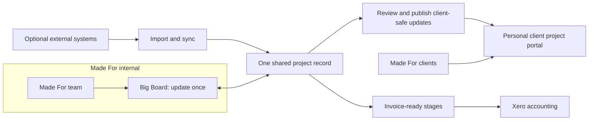

# Made For Studio Platform Plan

## The short version

Build one shared Made For platform with:

- An **internal Big Board** for opportunities, projects, Monday planning, tasks, capacity, forecasting, and invoice-ready work.
- Secure **client project portals** generated from the same project records, covering Team, Progress, Programme, Budget/Variations, Documents, and Tender.
- **Xero integration** for accounting workflow and financial status.
- An optional **Streamtime integration or replacement path**, decided separately after the core platform proves itself.

Made For updates information once. The appropriate information then appears internally, in personal client portals, and in accounting workflows without re-entry.

## Recommended architecture

Use one modular Next.js/TypeScript application, one managed PostgreSQL database, private file storage, managed authentication, background jobs, and one Vercel Pro deployment.

Client portals run from the same application, using URLs such as:

`bain-capital.projects.made-for.com.au`

The hostname selects the project experience; secure login and project membership control access. Internal data is never exposed merely by hiding it in the browser—client responses use explicit client-safe queries and immutable published revisions.

## Product boundaries

- **Made For platform owns:** pipeline, canonical projects, project stages, weekly planning, tasks, capacity intent, client publication, programme, documents, variations, and tender.
- **Xero owns:** accounting contacts, tax, invoices after export, payments, credits, and bank reconciliation.
- **HubSpot:** planned replacement.
- **Streamtime during rollout:** can remain authoritative for actual time, WIP, and operational invoicing.
- **Streamtime retirement:** adds timesheets, rates, availability, WIP, billing, and profitability; it is not implied by adding task lists.

## Build it in small stages

1. **Discovery — 2–3 weeks**
   - Confirm workflows, permissions, data ownership, migration size, success measures, and the Xero/Streamtime boundary.
2. **Foundation — 3–4 weeks**
   - Build environments, identity, permissions, shared schema, audit, file storage, backups, testing, and wildcard portal domains.
3. **End-to-end proof — 2–3 weeks**
   - Update one real project internally, preview/publish it, and show it securely at a personal client URL.
4. **Core Big Board — 5–7 weeks**
   - Opportunities, projects, Monday ritual, Todoist-style tasks, people/capacity, overview, forecasts, and invoice-ready signals.
5. **Complete Client Tracker — 5–7 weeks**
   - Team, Progress, Programme, Budget/Variations, Documents, Tender, reusable setup, approvals, and history.
6. **Integrations, migration, and launch — 7–11 weeks**
   - HubSpot/active-project migration, Xero, optional Streamtime adapter, administration, real Monday pilots, live client projects, and staged rollout.
7. **Optional Streamtime replacement — 8–12+ additional weeks**
   - Actual time, WIP, rates, billing, profitability, two billing-cycle parallel run, finance acceptance, and decommissioning.

Planning range:

- Core platform with Streamtime retained during rollout: approximately **18–26 weeks**.
- Including Streamtime replacement: approximately **26–38+ weeks**.

These are planning ranges rather than a fixed quote. Source-data quality, workflow decisions, team composition, and the depth of Streamtime replacement can materially change them.

## Critical delivery rules

- Design the shared data and permission model upfront, then release small end-to-end slices.
- Test with real Made For staff and live projects early.
- Do not automatically expose internal commentary to clients.
- Safe approved facts may update automatically; narrative/sensitive content uses preview and publish.
- Every approval and issued document targets an immutable version.
- Every integrated field has one authoritative system owner.
- Only one system writes accounting documents into Xero.
- Do not retire Streamtime before two reconciled billing cycles and finance sign-off.

## Success measures

- At least 90% of required Monday updates completed before issue publication by week four.
- Every active opportunity/project has an owner, stage, next key date, and last-confirmed timestamp.
- A new client tracker can be provisioned in under 15 minutes without code or a new deployment.
- Invoice-ready work reaches the designated accounting workflow within one business day.
- Capacity values are explainable from availability, allocation, and task estimates.
- No client can access another project or an internal-only field.
- Every approval and issued document resolves to a named actor, timestamp, and immutable version.
- A 90-day review demonstrates sustained adoption and informs the Streamtime retirement decision.

## Detailed supporting plans

- [Technical architecture](madefor_architecture.md)
- [Phased delivery roadmap](madefor_delivery_roadmap.md)
- [Integrations and migration](madefor_integrations_and_migration.md)
- [Product scope and success](madefor_scope_and_success.md)

The master plan stays concise; the linked documents preserve the detailed technical reasoning required for scoping and implementation.
